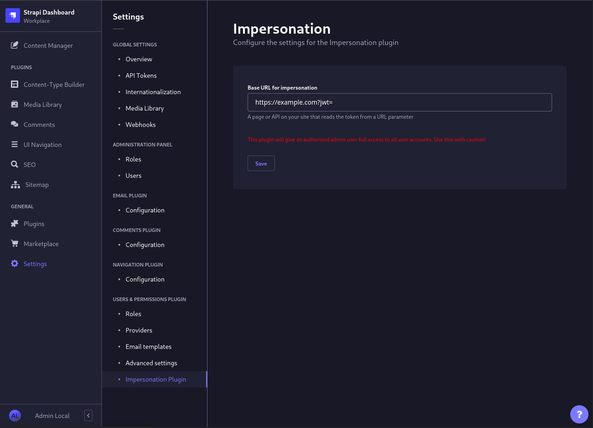

<div align="center">
  <h1>Strapi v4 - Impersonation Plugin</h1>
  <p>Impersonate any user on your site right from strapi</p>
  <a href="https://www.npmjs.org/package/strapi-plugin-impersonation">
    
  </a>
  <a href="https://www.npmjs.org/package/strapi-plugin-impersonation">
    
  </a>
</div>

> This plugin allows all admin users with sufficient permissions to impersonate any user on your site! So use it with caution!

## Use cases

- development environment where you do not want to save users passwords
- staging/testing environment with randomly generated user accounts where you do not want to have static passwords
- production environment when users report some problems on the website and you cannot reproduce the issue in development/staging (**use with caution!!**)

## Requirements

This plugin requires the following, in order to work correctly:
- Strapi v4 (this plugin is not compatible with v3)
- The plugin **users-permissions** installed and enabled (`@strapi/plugin-users-permissions` [[npm](https://www.npmjs.com/package/@strapi/plugin-users-permissions)])
- After setup configure your BaseURL on the frontend (see [Configuration](#configuration))

Unless you have the previous set up, the button on the right where you can impersonatethe user will not show up.

## Installation
```bash
# with npm
$ npm install strapi-plugin-impersonation
# or with yarn
$ yarn add strapi-plugin-impersonation
```

After successful installation you have to build a fresh package that includes plugin UI:

```bash
# with npm
$ npm run build && npm run develop
# or with yarn
$ yarn build && yarn develop
```

## Configuration

To work this plugin needs a **Base URL** where the token will be inserted.

This URL can be set in `Settings > Users & Permissions Plugin > Impersonation Plugin`



To get it working in your frontend you will need to setup a route that reads the jwt-token from URL parameters. This can be an API, a serverSide page that will set a cookie or alternatively in the case of saving the user authentication in localStorage a page that reads it from the browser query.

Here is an example to get it working in a Next.js Application on the Frontend:

```jsx
import { useRouter } from 'next/router'
import { useAuth } from 'lib/auth'

function ImpersonationPage() {
  const router = useRouter()
  // Some kind of hook where you can set your jwt token
  const {setToken} = useAuth()

  useEffect(() => {
    const token = router.query['jwt']
    setToken(token)
    router.push('/')
  }, [router])

  return <div>redirecting...</div>
}
```
